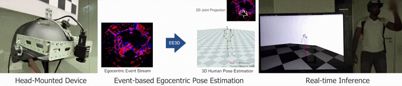
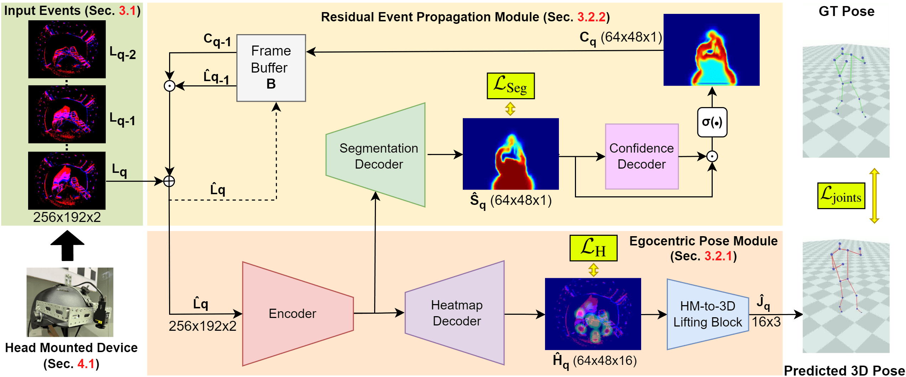

# EventEgo3D: 3D Human Motion Capture from Egocentric Event Streams [CVPR'24]
<center>

Christen Millerdurai<sup>1,2</sup>, Hiroyasu Akada<sup>1</sup>, Jian Wang<sup>1</sup>, Diogo Luvizon<sup>1</sup>, Christian Theobalt<sup>1</sup>, Vladislav Golyanik<sup>1</sup>

<sup>1</sup> Max Planck Institute for Informatics, SIC  &nbsp; &nbsp; &nbsp; &nbsp; <sup>2</sup> Saarland University, SIC  

</center>

## Official PyTorch implementation

[Project page](https://4dqv.mpi-inf.mpg.de/EventEgo3D/) | [Paper](#) 

<p align="center">
</br>
</p>

### Abstract

Monocular egocentric 3D human motion capture is a challenging and actively researched problem. Existing methods use synchronously operating visual sensors (e.g. RGB cameras) and often fail under low lighting and fast motions, which can be restricting in many applications involving head-mounted devices. In response to the existing limitations, this paper 1) introduces a new problem, i.e. **3D human motion capture from an egocentric monocular event camera with a fisheye lens**, and 2) proposes the first approach to it called EventEgo3D (EE3D). Event streams have high temporal resolution and provide reliable cues for **3D human motion capture under high-speed human motions and rapidly changing illumination**. The proposed EE3D framework is specifically tailored for learning with event streams in the LNES representation, enabling high 3D reconstruction accuracy. We also design a prototype of a mobile head-mounted device with an event camera and record a real dataset with event observations and the ground-truth 3D human poses (in addition to the synthetic dataset). Our EE3D demonstrates robustness and superior 3D accuracy compared to existing solutions across various challenging experiments while supporting **real-time 3D pose update rates of 140Hz**.

### Advantages of Event Based Vision
High Speed Motion                      |  Low Light Performance          
:-------------------------:|:-------------------------:|
|  |  |

### EventEgo3D

<p align="center">
</br>
</p>

## Usage
-----
- [EventEgo3D: 3D Human Motion Capture from Egocentric Event Streams \[CVPR'24\]](#eventego3d-3d-human-motion-capture-from-egocentric-event-streams-cvpr24)
  - [Official PyTorch implementation](#official-pytorch-implementation)
    - [Abstract](#abstract)
    - [Advantages of Event Based Vision](#advantages-of-event-based-vision)
    - [EventEgo3D](#eventego3d)
  - [Usage](#usage)
    - [Installation](#installation)
      - [Dependencies](#dependencies)
      - [Pretrained Model](#pretrained-model)
    - [Datasets](#datasets)
    - [Training](#training)
    - [Evaluation](#evaluation)
      - [EE3D-S](#ee3d-s)
      - [EE3D-R](#ee3d-r)
  - [Citation](#citation)
  - [License](#license)
  - [Acknowledgements](#acknowledgements)
------

### Installation

Clone the repository
```bash
git clone https://github.com/Chris10M/EventEgo3D.git
cd EventEgo3D
```

#### Dependencies
Create a conda enviroment from the file 
```bash
conda env create -f EventEgo3D.yml
```
Next, install  **[ocam_python](https://github.com/Chris10M/ocam_python.git)** using pip
```bash
pip3 install git+https://github.com/Chris10M/ocam_python.git
```


#### Pretrained Model 

The pretrained model ```best_model_state_dict.pth``` can be found [here](https://eventego3d.mpi-inf.mpg.de/CVPR/best_model_state_dict.pth). Please place the model in the following folder structure.

```bash
EventEgo3D
|
└── saved_models
         |
         └── best_model_state_dict.pth
```


### Datasets

The datasets can obtained by executing the files in [`dataset_scripts`](./dataset_scripts/). For detailed information, refer [here](./dataset_scripts/). 


### Training

For training, ensure [EE3D-S](./dataset_scripts#ee3d-s), [EE3D-R](./dataset_scripts#ee3d-r) and [EE3D[BG-AUG]](./dataset_scripts#ee3d-bg-aug) are present. 
The batch size and checkpoint path can be specified with the following environment variables, ```BATCH_SIZE``` and ```CHECKPOINT_PATH```.

```bash
python train.py 
```

### Evaluation

#### EE3D-S 
For evaluation, ensure [EE3D-S Test](./dataset_scripts#ee3d-s-test) is present. Please run, 

```bash
python evaluate_ee3d_s.py 
```

The provided [pretrained](#pretrained-model) checkpoint gives us an accuracy of,

| Arch | Head_MPJPE | Neck_MPJPE | Right_shoulder_MPJPE | Right_elbow_MPJPE | Right_wrist_MPJPE | Left_shoulder_MPJPE | Left_elbow_MPJPE | Left_wrist_MPJPE | Right_hip_MPJPE | Right_knee_MPJPE | Right_ankle_MPJPE | Right_foot_MPJPE | Left_hip_MPJPE | Left_knee_MPJPE | Left_ankle_MPJPE | Left_foot_MPJPE | MPJPE | Head_PAMPJPE | Neck_PAMPJPE | Right_shoulder_PAMPJPE | Right_elbow_PAMPJPE | Right_wrist_PAMPJPE | Left_shoulder_PAMPJPE | Left_elbow_PAMPJPE | Left_wrist_PAMPJPE | Right_hip_PAMPJPE | Right_knee_PAMPJPE | Right_ankle_PAMPJPE | Right_foot_PAMPJPE | Left_hip_PAMPJPE | Left_knee_PAMPJPE | Left_ankle_PAMPJPE | Left_foot_PAMPJPE | PAMPJPE |
|---|---|---|---|---|---|---|---|---|---|---|---|---|---|---|---|---|---|---|---|---|---|---|---|---|---|---|---|---|---|---|---|---|---|---|
| EgoHPE | 29.020 | 44.788 | 51.028 | 98.415 | 144.434 | 53.148 | 103.996 | 141.923 | 91.309 | 146.183 | 210.144 | 224.728 | 87.292 | 141.563 | 210.710 | 219.027 | 124.857 | 50.010 | 47.727 | 50.475 | 86.859 | 131.602 | 53.526 | 90.658 | 127.851 | 74.953 | 98.317 | 116.803 | 129.032 | 75.543 | 96.434 | 119.562 | 132.058 | 92.588 |


#### EE3D-R
For evaluation, ensure [EE3D-R](./dataset_scripts#ee3d-r) is present. Please run, 

```bash
python evaluate_ee3d_r.py 
```

The provided [pretrained](#pretrained-model) checkpoint gives us an accuracy of,

| Arch | walk_MPJPE | crouch_MPJPE | pushup_MPJPE | boxing_MPJPE | kick_MPJPE | dance_MPJPE | inter. with env_MPJPE | crawl_MPJPE | sports_MPJPE | jump_MPJPE | MPJPE | walk_PAMPJPE | crouch_PAMPJPE | pushup_PAMPJPE | boxing_PAMPJPE | kick_PAMPJPE | dance_PAMPJPE | inter. with env_PAMPJPE | crawl_PAMPJPE | sports_PAMPJPE | jump_PAMPJPE | PAMPJPE |
|---|---|---|---|---|---|---|---|---|---|---|---|---|---|---|---|---|---|---|---|---|---|---|
| EgoHPE | 70.881 | 163.840 | 97.886 | 136.571 | 103.724 | 88.877 | 103.191 | 109.714 | 101.020 | 97.320 | 107.302 | 52.113 | 99.483 | 75.530 | 104.667 | 86.055 | 71.968 | 70.859 | 77.949 | 77.827 | 80.179 | 79.663 |

## Citation

If you find this code useful for your research, please cite our paper:
```
@inproceedings{Millerdurai_EventEgo3D_2024, 
    title={EventEgo3D: 3D Human Motion Capture from Egocentric Event Streams}, 
    author={Christen Millerdurai and Hiroyasu Akada and Jian Wang and Diogo Luvizon and Christian Theobalt and Vladislav Golyanik}, 
    booktitle = {Computer Vision and Pattern Recognition (CVPR)}, 
    year={2024} 
} 
```

## License

Ev2Hands is under [CC-BY-NC 4.0](https://creativecommons.org/licenses/by-nc/4.0/) license. The license also applies to the pre-trained models.

## Acknowledgements

The code is partially adapted from [here](https://github.com/microsoft/human-pose-estimation.pytorch). 

